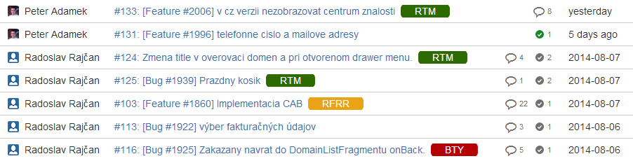
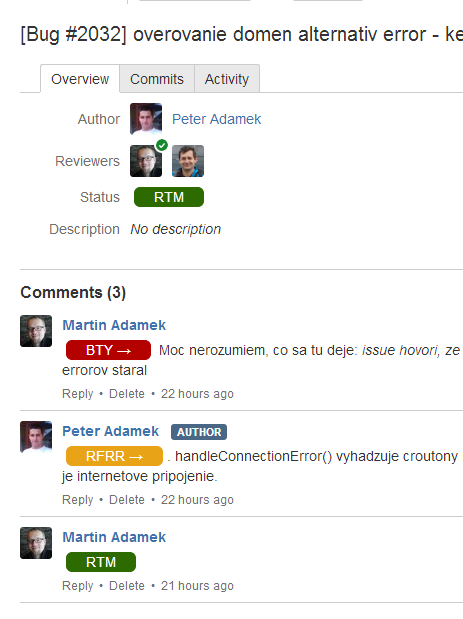

Bitbucket PR Badges
===================

Author: Juraj Novák, [Inloop](http://www.inloop.eu)

This browser userscrip enhances the Bitbucket pull request summary and detail website by adding status badges. These badges indicate the pull request's current state. The reviewer usually posts a comment **BTY** which means Back To You (there are errors you need to fix first), or **RTM** (Ready To Merge) which tells the developer that he can merge this pull request into master. The developer writes **RFRR** (Ready For Re-Review) in case he has fixed the problems and signals the reviewer to review it again.(this is usually after **BTY** from the reviewer).

These abbreviations are parsed by the script and transformed in colored badges. And the last status is also shown in the pull request summary in the repository, so that the reviewers/developers can quickly find pull requests that need their attention.

###Supported review abbreviations###

Abbreviation | Meaning     | Badge
-----|---------------------|------------------------------
BTY  | Back to You         |  |
RFRR | Ready for Re-Review |  |
RTM  |Ready to Merge       |  |

##How to install##

**[Install the script](https://raw.githubusercontent.com/inloop/bitbucket-pr-badges/master/code/better_bitbucket.user.js)** directly into your browser.  You need have a userscript manager extension installed in your browser, such as [Tampemonkey](https://chrome.google.com/webstore/detail/tampermonkey/dhdgffkkebhmkfjojejmpbldmpobfkfo) for Google Chrome (see bottom of readme). 
The script will be automatically updated (depends on the extension manager, but most will update by default).  
**Google Chrome extension is in development**.

This script works with following userscript manager extensions:

**Google Chrome:**  [Tampermonkey 3.8+](https://chrome.google.com/webstore/detail/tampermonkey/dhdgffkkebhmkfjojejmpbldmpobfkfo)  
**Mozilla Firefox:** [Greasemonkey 2.1+](https://addons.mozilla.org/sk/firefox/addon/greasemonkey/)  
**Opera** [Violentmonkey 2.1+](https://addons.opera.com/sk/extensions/details/violent-monkey/)  (or Tampermonkey)  
**Safari** not tested yet - [NinjaKit](https://github.com/os0x/NinjaKit)

###See the current state of the pull request without the need to open it###

###The comments section now contains badges so you can quickly see the the progress###
